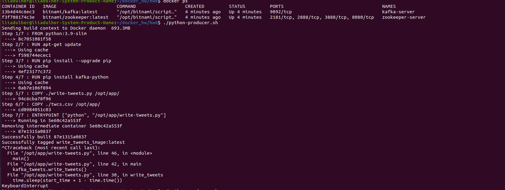
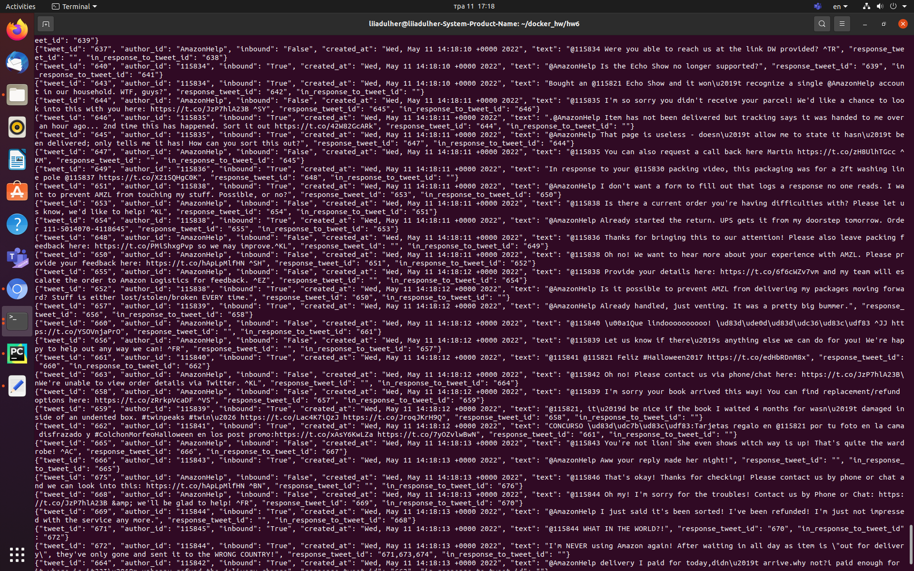

# Docker hw6
Kafka 2

## Team: [Liia_Dulher](https://github.com/LiiaDulher)

### Prerequiments
Please put file <b>twcs.csv</b> in this directory.

### Usage
````
$ sudo chmod +x run-cluster.sh
$ sudo chmod +x shutdown-cluster.sh
$ sudo chmod +x python-producer.sh
````
````
$ ./run-cluster.sh
$ ./python-producer.sh
$ ./shutdown-cluster.sh
````

### Results


